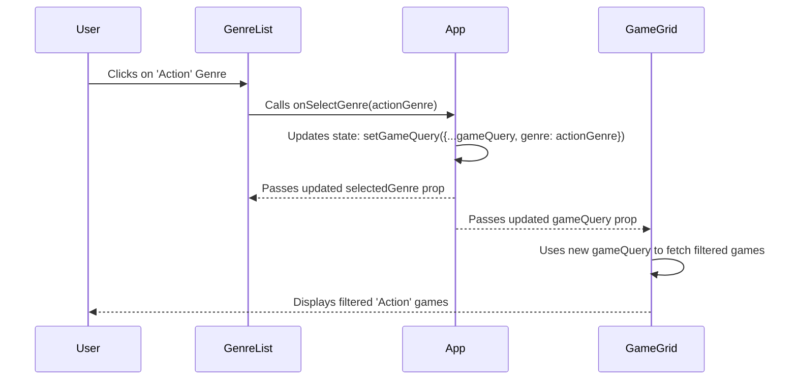

# Chapter 1: App Component & GameQuery State

Welcome to the Game Hub project tutorial! We're excited to have you here. If you're new to web development or React, don't worry, we'll guide you step-by-step.

Imagine you're building an app to browse video games. You want users to be able to filter games by genre (like "Action" or "RPG"), by platform (like "PlayStation" or "PC"), sort them (by release date or popularity), and even search for specific titles. How does the app keep track of all these choices and show the right games accordingly?

This is where our main application component, `App.tsx`, and a special piece of information called the `gameQuery` state come into play.

## The Brain of the Operation: `App.tsx`

Think of `App.tsx` as the main control center or the "brain" of our Game Hub application. It's the top-level component that arranges all the different parts of our user interface:

*   The navigation bar at the top (`NavBar`)
*   The list of genres on the side (`GenreList`)
*   The main area where games are displayed (`GameGrid`)
*   Dropdown menus to select platforms (`PlatformSelector`) and sorting options (`SortSelector`)

`App.tsx` doesn't do all the work itself, but it *coordinates* the work of these other components.

Here's a simplified look at how `App.tsx` sets up the layout using a grid system (provided by a library called Chakra UI):

```typescript
// src/App.tsx (Simplified Layout)
import { Grid, GridItem, Show } from "@chakra-ui/react";
// ... other imports for components like NavBar, GenreList, GameGrid ...

function App() {
  // ... state management (we'll get to this!) ...

  return (
    <Grid /* Defines the overall grid structure */
      templateAreas={{
        base: `"nav" "main"`, // Mobile: nav on top, main below
        lg: `"nav nav" "aside main"`, // Large screens: nav spans top, aside left, main right
      }}
      // ... other layout props ...
    >
      <GridItem area="nav">
        {/* NavBar component goes here */}
      </GridItem>
      <Show above="lg"> {/* Only show GenreList on large screens */}
        <GridItem area="aside">
          {/* GenreList component goes here */}
        </GridItem>
      </Show>
      <GridItem area="main">
        {/* GameHeading, PlatformSelector, SortSelector, GameGrid go here */}
      </GridItem>
    </Grid>
  );
}

export default App;
```

This code uses `Grid` and `GridItem` to define different areas (`nav`, `aside`, `main`) and places our other components within them. `Show above="lg"` is a handy way to make parts of the layout (like the genre list sidebar) appear only on larger screens.

## Remembering User Choices: The `GameQuery` State

Now, how does `App.tsx` keep track of what the user wants to see? It uses something called **state**. In React, "state" is simply data that a component holds onto, which can change over time. When state changes, React automatically updates the parts of the screen that depend on that state.

In our `App` component, we have a specific piece of state called `gameQuery`. Think of `gameQuery` as a little notepad where `App` jots down the user's current preferences:

*   Which genre did they click?
*   Which platform did they select?
*   How do they want the games sorted?
*   Did they type anything into the search bar?

We define the structure of this notepad using a TypeScript `interface`:

```typescript
// src/App.tsx
export interface GameQuery {
  genre: Genre | null;      // The selected genre object (or null if none)
  platform: Platform | null; // The selected platform object (or null if none)
  sortOrder: string;        // A string indicating sorting (e.g., "name", "-released")
  searchText: string;       // The text typed into the search bar
}
// Note: Genre and Platform types are defined elsewhere,
// we'll cover them in [Chapter 2: Data Types (TypeScript Interfaces)](02_data_types__typescript_interfaces__.md)
```

Inside the `App` component, we use a React feature called the `useState` hook to create and manage this `gameQuery` state:

```typescript
// src/App.tsx
import { useState } from "react";
// ... other imports ...
export interface GameQuery { /* ... as defined above ... */ }
type Genre = { id: number, name: string }; // Simplified for example
type Platform = { id: number, name: string }; // Simplified for example

function App() {
  // Create the 'gameQuery' state variable and a function to update it ('setGameQuery')
  const [gameQuery, setGameQuery] = useState<GameQuery>({} as GameQuery);
  // '{} as GameQuery' initializes it as an empty object, satisfying the type.

  // ... rest of the component ...
  return ( /* ... Grid layout ... */ );
}
```

Here, `useState<GameQuery>({} as GameQuery)` does two things:
1.  It creates a state variable named `gameQuery` that will hold our "notepad" object. It's initialized as basically empty.
2.  It gives us a function named `setGameQuery` that we can use *only* to update the `gameQuery` state.

## Updating the Notepad: How Filters Change `GameQuery`

When you click on a genre in the `GenreList`, select "PlayStation" from the `PlatformSelector`, or type "cyberpunk" in the `SearchInput`, how does the `gameQuery` state get updated?

`App.tsx` passes special functions down to these components as props. For example, it passes an `onSelectGenre` function to `GenreList`.

```typescript
// src/App.tsx (Inside the App component)

// ... useState for gameQuery ...

return (
  <Grid /* ...layout... */ >
    {/* ... NavBar setup ... */}
    <Show above="lg">
      <GridItem area="aside" paddingX={5}>
        <GenreList // The component that shows the list of genres
          selectedGenre={gameQuery.genre} // Pass the current selection down
          // Pass a function down to handle when a genre is selected
          onSelectGenre={(genre) => setGameQuery({ ...gameQuery, genre })}
        />
      </GridItem>
    </Show>
    {/* ... other components ... */}
  </Grid>
);
```

Let's break down that `onSelectGenre` function:
*   `onSelectGenre={(genre) => ...}`: This defines a function that `GenreList` can call. When called, it will receive the selected `genre` object as an argument.
*   `setGameQuery({ ...gameQuery, genre })`: This is the crucial part! It calls the state updater function `setGameQuery`.
    *   `{ ...gameQuery }`: This is JavaScript's "spread syntax". It copies all the *existing* properties from the current `gameQuery` (like `platform`, `sortOrder`, `searchText`).
    *   `, genre`: This adds or overwrites the `genre` property in the new object with the newly selected `genre` that was passed into the function.

So, if the user clicks the "Action" genre, `GenreList` calls this function with the "Action" genre object. `setGameQuery` then updates the state to be a *new* object that looks like: `{ platform: [whatever was selected], sortOrder: [whatever was selected], searchText: [whatever was searched], genre: [the "Action" genre object] }`.

The same pattern applies to `PlatformSelector` (using `onSelectPlatform`), `SortSelector` (using `onSelectSortOrder`), and `NavBar`/`SearchInput` (using `onSearch`). Each updates its specific part of the `gameQuery` state while keeping the other parts the same.

## Making Things Happen: How `GameQuery` Affects the Display

Okay, so `App` updates its `gameQuery` notepad. Now what?

When the `gameQuery` state changes (because `setGameQuery` was called), React automatically re-renders the `App` component *and* any child components that receive `gameQuery` as a prop.

Two key components rely on `gameQuery`:

1.  **`GameHeading`**: Displays a title like "Action Games" or "PC RPG Games".
2.  **`GameGrid`**: Displays the actual grid of game cards.

`App.tsx` passes the *current* `gameQuery` object down to them:

```typescript
// src/App.tsx (Inside the App component's return statement)

// ... inside the "main" GridItem ...
<GameHeading gameQuery={gameQuery} /> {/* Pass gameQuery to GameHeading */}
<Flex> {/* For layout */}
  {/* PlatformSelector and SortSelector also receive parts of gameQuery or update functions */}
</Flex>
<GameGrid gameQuery={gameQuery} /> {/* Pass gameQuery to GameGrid */}
```

Inside `GameHeading.tsx`:

```typescript
// src/components/GameHeading.tsx
import { Heading } from '@chakra-ui/react';
import { GameQuery } from '../App'; // Import the structure definition

interface Props { gameQuery: GameQuery } // Expect gameQuery as a prop

const GameHeading = ({ gameQuery }: Props) => {
  // Construct the heading text based on selected platform and genre names
  const heading = `${gameQuery.platform?.name || ''} ${gameQuery.genre?.name || ''} Games`;
  // (The '?.' prevents errors if platform or genre is null)

  return <Heading as='h1'>{heading}</Heading>;
}
export default GameHeading;
```

Inside `GameGrid.tsx`:

```typescript
// src/components/GameGrid.tsx
import { SimpleGrid, Text } from "@chakra-ui/react";
import { GameQuery } from "../App"; // Import the structure definition
import useGames from "../hooks/useGames"; // The hook that fetches data
// ... other imports ...

interface Props { gameQuery: GameQuery } // Expect gameQuery as a prop

const GameGrid = ({ gameQuery }: Props) => {
  // Pass the entire gameQuery object to our data-fetching hook
  const { data, error, isLoading } = useGames(gameQuery);
  // We'll learn about useGames in [Chapter 5: Data Fetching Hooks](05_data_fetching_hooks_.md)

  // ... logic to display loading indicators, errors, or game cards based on 'data' ...
};
export default GameGrid;
```

When `gameQuery` changes in `App`, `GameHeading` receives the new query and updates the title text. `GameGrid` receives the new query and uses it (via the `useGames` hook) to fetch a *new list of games* matching those criteria from the game server. The grid then updates to show the new games.

## Visualizing the Flow

Here's a diagram showing what happens when a user clicks a genre:



## In Summary

*   The `App` component (`App.tsx`) is the central coordinator of our application.
*   It holds the `gameQuery` state, which acts like a notepad storing the user's current filtering, sorting, and search preferences.
*   Components like `GenreList`, `PlatformSelector`, etc., receive functions from `App` (like `onSelectGenre`) to call when the user makes a selection.
*   These functions use `setGameQuery` to update the `gameQuery` state in `App`.
*   When `gameQuery` changes, `App` passes the updated `gameQuery` object down as props to components like `GameHeading` and `GameGrid`.
*   These components use the updated `gameQuery` to change what they display (e.g., update the title or fetch and show a new list of games).

This pattern of holding state in a central parent component (`App`) and passing both the state value and update functions down to child components is very common in React. It helps keep our application organized and ensures that different parts of the UI stay in sync with the user's choices.

## Next Steps

We've seen *how* `App` stores the user's choices in the `gameQuery` object. But what exactly *is* a `Genre` object or a `Platform` object that we store inside `gameQuery`? In the next chapter, we'll dive into how we define the precise "shape" of our data using TypeScript.

Ready to define our data? Let's move on to [Chapter 2: Data Types (TypeScript Interfaces)](02_data_types__typescript_interfaces__.md)!

---

Generated by [AI Codebase Knowledge Builder](https://github.com/The-Pocket/Tutorial-Codebase-Knowledge)