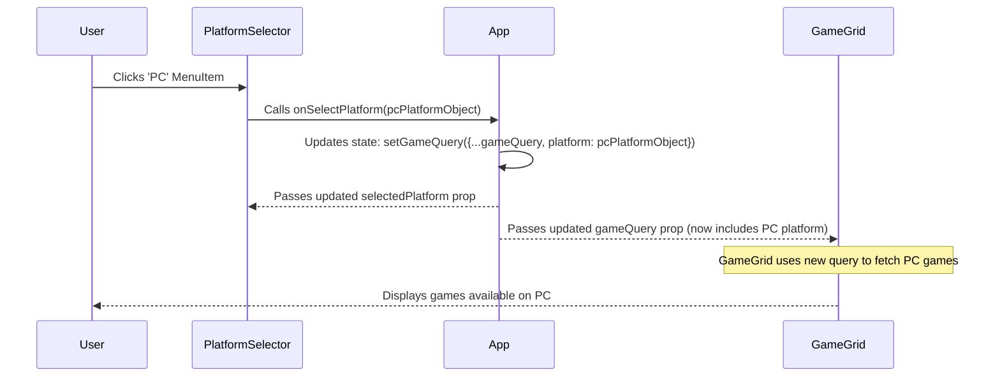

# Chapter 3: Filtering & Sorting Components

Welcome back! In [Chapter 2: Data Types (TypeScript Interfaces)](02_data_types__typescript_interfaces__.md), we learned how TypeScript interfaces act like blueprints, defining the exact shape of our data objects like `Genre`, `Platform`, and the crucial `GameQuery`.

Now, how do we actually *let the user* change the values inside that `GameQuery` object in `App.tsx`? If `App.tsx` is the brain holding the user's preferences ([Chapter 1: App Component & GameQuery State](01_app_component___gamequery_state_.md)), how does the user communicate their choices *to* the brain?

This is where our **Filtering and Sorting Components** come in! Think of them like the knobs, buttons, and search bar on a fancy TV remote or a music player control panel. They provide the user interface elements to make choices, and when a choice is made, they send a signal back to the main system (`App.tsx`) to update the `GameQuery`.

## The Goal: User Control

Imagine you're browsing a huge online library of games. You don't want to scroll through thousands of titles! You probably want to see only "Action" games, or maybe just games available on "PC", or perhaps sort the list by the newest releases.

Our filtering and sorting components provide exactly these controls:

*   **`GenreList`**: A list on the side (on larger screens) where you can click a specific genre like "Action", "RPG", or "Strategy".
*   **`PlatformSelector`**: A dropdown menu to pick a gaming platform like "PC", "PlayStation 5", or "Xbox Series X".
*   **`SortSelector`**: Another dropdown to choose how the games should be ordered (e.g., by Name, Release Date, Popularity).
*   **`SearchInput`**: A search box (usually in the navigation bar) where you can type game titles.

Each of these components focuses on one specific part of the `GameQuery`. When you interact with one, its job is to tell `App.tsx`, "Hey, the user just selected this genre!" or "The user wants to sort by release date now!"

## The Magic Trick: Functions as Messengers (Props)

How do these components send messages back up to `App.tsx`? They don't directly reach into `App.tsx` and change its state (that would be messy!). Instead, `App.tsx` uses a common React pattern:

1.  **Define Update Logic:** `App.tsx` creates functions that know how to update specific parts of the `gameQuery` state. For example, a function specifically for updating the selected genre.
2.  **Pass Functions Down:** `App.tsx` passes these special update functions *down* to the relevant child components as **props**. Think of it like handing `GenreList` a pre-addressed envelope specifically for sending genre updates back to `App`.
3.  **Call the Function:** When the user interacts with the child component (e.g., clicks a genre in `GenreList`), the component calls the function it received as a prop, passing the user's new choice (e.g., the "Action" genre object) as an argument.
4.  **State Updates in App:** The function runs back up in `App.tsx`, updating the `gameQuery` state with the new value.
5.  **Re-render:** React automatically re-renders `App` and any components that depend on `gameQuery`, like the [Chapter 4: Game Display Components](04_game_display_components_.md), showing the newly filtered/sorted games.

Let's look at each component and see how this works.

### `GenreList` - Picking a Category

This component displays the list of game genres. It needs to know *which* genre is currently selected (to maybe highlight it) and *how* to tell `App` when a new genre is clicked.

**Props it receives from `App.tsx`:**

*   `selectedGenre: Genre | null`: The currently selected genre object (or `null`), used for highlighting.
*   `onSelectGenre: (genre: Genre) => void`: The function to call when a user clicks a genre.

**Inside `GenreList.tsx` (Simplified):**

```typescript
// src/components/GenreList.tsx
import { Button, List, ListItem } from "@chakra-ui/react";
import { Genre } from "../hooks/useGenres"; // Import the blueprint

// Define the props this component expects
interface Props {
  onSelectGenre: (genre: Genre) => void; // The function from App
  selectedGenre: Genre | null;
}

const GenreList = ({ selectedGenre, onSelectGenre }: Props) => {
  // ... code to fetch genres (data) using useGenres hook ...

  return (
    <List>
      {/* Loop through each genre fetched */}
      {data?.results.map((genre: Genre) => (
        <ListItem key={genre.id}>
          <Button
            // Highlight if this genre is the selected one
            fontWeight={genre.id === selectedGenre?.id ? "bold" : "normal"}
            // CRUCIAL: When clicked, call the function passed from App!
            onClick={() => onSelectGenre(genre)} // <-- The Magic!
            variant="link"
          >
            {genre.name} {/* Display the genre name */}
          </Button>
        </ListItem>
      ))}
    </List>
  );
};

export default GenreList;
```

**Explanation:**

*   We define the `Props` interface to specify that `GenreList` expects `onSelectGenre` and `selectedGenre`.
*   Inside the list, for each `genre`, we create a `Button`.
*   The key part is `onClick={() => onSelectGenre(genre)}`. This means: "When this button is clicked, execute the `onSelectGenre` function that was given to me, and pass the specific `genre` associated with this button as the argument."

### `PlatformSelector` - Choosing a Console/System

This component is a dropdown menu for platforms.

**Props it receives from `App.tsx`:**

*   `selectedPlatform: Platform | null`: The currently selected platform.
*   `onSelectPlatform: (platform: Platform) => void`: The function to call when a user picks a platform.

**Inside `PlatformSelector.tsx` (Simplified):**

```typescript
// src/components/PlatformSelector.tsx
import { Button, Menu, MenuButton, MenuItem, MenuList } from "@chakra-ui/react";
import { Platform } from "../hooks/usePlatforms"; // Import the blueprint

interface Props {
  onSelectPlatform: (platform: Platform) => void; // Func from App
  selectedPlatform: Platform | null;
}

const PlatformSelector = ({ onSelectPlatform, selectedPlatform }: Props) => {
  // ... code to fetch platforms (data) using usePlatforms hook ...

  return (
    <Menu>
      {/* The button that shows the current selection or 'Platforms' */}
      <MenuButton as={Button}>
        {selectedPlatform?.name ?? "Platforms"}
      </MenuButton>
      <MenuList>
        {/* Loop through each platform fetched */}
        {data?.results.map((platform: Platform) => (
          <MenuItem
            // CRUCIAL: When this menu item is clicked...
            onClick={() => onSelectPlatform(platform)} // <-- The Magic!
            key={platform.id}
          >
            {platform.name} {/* Display platform name */}
          </MenuItem>
        ))}
      </MenuList>
    </Menu>
  );
};
export default PlatformSelector;
```

**Explanation:**

*   Similar to `GenreList`, it receives `selectedPlatform` and the update function `onSelectPlatform`.
*   It uses the Chakra UI `Menu` components to create a dropdown.
*   Each `MenuItem` inside the dropdown has an `onClick` handler: `onClick={() => onSelectPlatform(platform)}`. When a user clicks on "PC", for example, this calls the `onSelectPlatform` function (given by `App`) with the "PC" platform object.

### `SortSelector` - Ordering the Games

Another dropdown, this one lets the user choose how to sort the games. Sorting is often done using specific string codes (like `"name"` for alphabetical or `"-released"` for newest first).

**Props it receives from `App.tsx`:**

*   `sortOrder: string`: The current sort order string.
*   `onSelectSortOrder: (sortOrder: string) => void`: The function to call when a user picks a sort option.

**Inside `SortSelector.tsx` (Simplified):**

```typescript
// src/components/SortSelector.tsx
import { Button, Menu, MenuButton, MenuItem, MenuList } from "@chakra-ui/react";

interface Props {
  onSelectSortOrder: (sortOrder: string) => void; // Func from App
  sortOrder: string;
}

const SortSelector = ({ onSelectSortOrder, sortOrder }: Props) => {
  // Define the available sort options
  const sortOrders = [
    { value: "", label: "Relevance" }, // Default
    { value: "name", label: "Name" },
    { value: "-released", label: "Release date" },
    // ... other sort options
  ];

  const currentSortOrder = sortOrders.find(order => order.value === sortOrder);

  return (
    <Menu>
      <MenuButton as={Button}>
        Order by: {currentSortOrder?.label || 'Relevance'}
      </MenuButton>
      <MenuList>
        {sortOrders.map((order) => (
          <MenuItem
            // CRUCIAL: Call the function with the sort 'value' string
            onClick={() => onSelectSortOrder(order.value)} // <-- The Magic!
            key={order.value}
          >
            {order.label} {/* Display user-friendly label */}
          </MenuItem>
        ))}
      </MenuList>
    </Menu>
  );
};
export default SortSelector;
```

**Explanation:**

*   It receives the current `sortOrder` string and the `onSelectSortOrder` function.
*   It defines a list of `sortOrders`, each with a `value` (the code sent to the API) and a `label` (what the user sees).
*   Each `MenuItem`'s `onClick` calls `onSelectSortOrder` with the corresponding `order.value`. If the user clicks "Name", it calls `onSelectSortOrder("name")`.

### `SearchInput` - Finding Specific Games

This component is usually part of the `NavBar`. It allows users to type text to search for games.

**Props it receives (via `NavBar` from `App.tsx`):**

*   `onSearch: (searchText: string) => void`: The function to call when the user submits a search query.

**Inside `SearchInput.tsx` (Simplified):**

```typescript
// src/components/SearchInput.tsx
import { Input, InputGroup } from "@chakra-ui/react";
import { useRef } from "react"; // Needed to get the input value

interface Props {
  onSearch: (searchText: string) => void; // Func from App (via NavBar)
}

const SearchInput = ({ onSearch }: Props) => {
  // ref is a way to directly access the input field element
  const ref = useRef<HTMLInputElement>(null);

  return (
    // Use a form to handle submission (e.g., pressing Enter)
    <form onSubmit={(event) => {
      event.preventDefault(); // Prevent page reload on submit
      // If the ref is connected and has a value, call onSearch
      if (ref.current) {
        onSearch(ref.current.value); // <-- The Magic!
      }
    }}>
      <InputGroup>
        {/* ... Input icon ... */}
        <Input ref={ref} placeholder="Search games..." />
      </InputGroup>
    </form>
  );
};
export default SearchInput;
```

**Explanation:**

*   It receives the `onSearch` function.
*   We use a standard HTML `<form>` element. When the form is submitted (usually by pressing Enter in the input field), its `onSubmit` event handler is triggered.
*   Inside `onSubmit`, we prevent the default browser behavior (page refresh).
*   We use `useRef` to get a direct reference (`ref`) to the `<Input>` element.
*   `ref.current` gives us access to the input field element, and `ref.current.value` gets the text the user typed.
*   We then call `onSearch(ref.current.value)`, sending the typed text back up to `App` (via `NavBar`).

## How it Looks in `App.tsx`

Let's revisit how `App.tsx` sets up one of these components, like `PlatformSelector`, passing down the current value and the update function:

```typescript
// src/App.tsx (Inside the App component's return statement)

// Get the state value and the state setter function from useState
const [gameQuery, setGameQuery] = useState<GameQuery>({} as GameQuery);

// ... inside the main GridItem ...
<PlatformSelector
  // Pass the current platform from the state down
  selectedPlatform={gameQuery.platform}
  // Define AND pass the update function down
  onSelectPlatform={(platform) => // 'platform' is the object clicked in PlatformSelector
    setGameQuery({ ...gameQuery, platform }) // Update state
  }
/>
// ... other components like SortSelector, GenreList are set up similarly ...
```

**Explanation:**

*   `selectedPlatform={gameQuery.platform}`: We pass the `platform` part of our `gameQuery` state *down* to `PlatformSelector` so it knows what's currently selected.
*   `onSelectPlatform={(platform) => setGameQuery({ ...gameQuery, platform })}`: We define an inline function right here. This function takes one argument (`platform`). When called, it uses `setGameQuery` to update the state.
    *   `{ ...gameQuery }`: This spread syntax copies all existing properties from the *current* `gameQuery` (like `genre`, `sortOrder`, `searchText`).
    *   `, platform`: This adds (or overwrites) the `platform` property in the new state object with the `platform` object that was just clicked by the user in `PlatformSelector`.
*   This inline function is passed *down* as the `onSelectPlatform` prop.

## Visualizing the Flow (Example: Selecting a Platform)

Here's what happens step-by-step when a user clicks "PC" in the `PlatformSelector`:



1.  **User Clicks:** The user interacts with `PlatformSelector`.
2.  **Call Update Function:** `PlatformSelector` calls the `onSelectPlatform` function it received from `App`, passing the selected platform object ("PC").
3.  **App Updates State:** The function executes inside `App`, calling `setGameQuery` to create a *new* `gameQuery` object that includes the selected platform while keeping other filters intact.
4.  **App Re-renders:** React detects the state change in `App`.
5.  **Props Update:** `App` passes the *new* `gameQuery` object down to components like `PlatformSelector` (so it can update its display) and `GameGrid`.
6.  **GameGrid Updates:** `GameGrid` receives the new `gameQuery` and uses it to fetch and display the games matching the new criteria (PC games in this case). We'll explore how `GameGrid` does this in [Chapter 4: Game Display Components](04_game_display_components_.md) and [Chapter 5: Data Fetching Hooks](05_data_fetching_hooks_.md).

## Summary

*   Components like `GenreList`, `PlatformSelector`, `SortSelector`, and `SearchInput` provide the user interface for filtering and sorting games.
*   They don't manage the filtering state themselves; they act as controls that send signals back to `App.tsx`.
*   `App.tsx` holds the central `gameQuery` state and defines functions to update specific parts of it.
*   These update functions are passed down to the filtering/sorting components as **props** (e.g., `onSelectGenre`, `onSelectPlatform`).
*   When a user interacts with a filter component (e.g., clicks a genre), the component calls the corresponding update function prop, passing the user's selection as an argument.
*   This triggers a state update in `App.tsx`, which in turn causes the relevant parts of the UI (like the game grid) to re-render with the new data.

This pattern of **"lifting state up"** to a common ancestor (`App.tsx`) and passing down both data and update functions is fundamental to how React applications manage interactions and keep the UI consistent.

## Next Steps

We've seen how users can tell our app *which* games they want to see using the filtering and sorting components. Now, how does the app actually *show* those games? Let's move on to the components responsible for displaying the game information itself.

Next up: [Chapter 4: Game Display Components](04_game_display_components_.md)!
