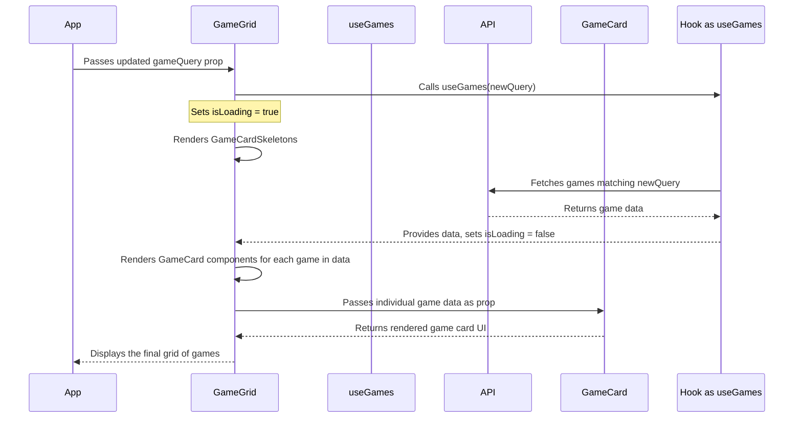

# Chapter 4: Game Display Components

Welcome back! In [Chapter 3: Filtering & Sorting Components](03_filtering___sorting_components_.md), we learned how users can tell our Game Hub app exactly *which* games they want to see by using filters (like genre or platform) and sorting options. These choices are stored in the `gameQuery` object within our main `App` component ([Chapter 1: App Component & GameQuery State](01_app_component___gamequery_state_.md)).

But selecting the games is only half the battle! How do we actually *show* the resulting list of games to the user in a nice, visual way? That's where our **Game Display Components** come into play.

## The Goal: Showing the Games

Imagine you've just walked into a video game store. You told the clerk, "Show me the latest RPGs for PlayStation 5." Now, you expect the clerk to lead you to a shelf displaying those specific game boxes, right?

Our Game Display Components work together to create that "shelf" in our app. They take the list of games that match the user's `gameQuery` and present them in an attractive grid format.

## The Display Crew: Meet the Components

We have a small team of components working together to display the games:

1.  **`GameGrid` (The Display Shelf):** This is the main component responsible for arranging everything. It fetches the list of games based on the user's current `gameQuery` (we'll see *how* it fetches in [Chapter 5: Data Fetching Hooks](05_data_fetching_hooks_.md)). It then decides how many columns to show based on screen size and places each game card onto the grid. Think of it as the main display shelf in the game store.

2.  **`GameCard` (The Game Box):** This component represents a single game on the shelf. It takes the data for one specific game (like its name, cover image, review score, and compatible platforms) and displays it visually, much like the front of a physical game box. It uses helper components like `CriticScore` and `PlatformIconList` to show details neatly.

3.  **`GameCardContainer` (The Stylish Wrapper):** This is a simple helper component that wraps around each `GameCard`. Its main job is to provide some consistent styling, like rounded corners and ensuring the image fits nicely. It's like the protective plastic sleeve or standard-sized spot on the shelf that makes each game box look uniform.

4.  **`GameCardSkeleton` (The Placeholder Box):** What happens while the clerk is fetching the games from the back room? You might see empty spots on the shelf or placeholder boxes. `GameCardSkeleton` does exactly this. It displays a greyed-out, pulsing placeholder shape that looks like a `GameCard`. This gives the user visual feedback that games are loading, especially on slower connections.

**Analogy Recap:**

*   `GameGrid`: The display shelves.
*   `GameCard`: An individual game box on the shelf.
*   `GameCardContainer`: The standard-sized slot or wrapper for each box.
*   `GameCardSkeleton`: An empty placeholder box shown while new games are being loaded.

## How They Work Together: `GameGrid` Takes Charge

The `GameGrid` component is the star of the show here. It orchestrates the display. Here's the basic idea of how it uses the other components:

1.  **Get the User's Choices:** `GameGrid` receives the latest `gameQuery` object from `App.tsx` as a prop. This tells it which games the user currently wants to see.
2.  **Fetch the Games:** `GameGrid` uses the `gameQuery` to ask for the matching list of games. (It uses a special function called a "hook", specifically `useGames`, which we'll cover in detail in [Chapter 5: Data Fetching Hooks](05_data_fetching_hooks_.md)).
3.  **Handle Loading:** While the games are being fetched, the `useGames` hook tells `GameGrid` that it's `isLoading`. During this time, `GameGrid` displays multiple `GameCardSkeleton` components inside `GameCardContainer`s to show that content is coming soon.
4.  **Display Games:** Once the game data arrives, `useGames` gives the list of games (`data`) to `GameGrid` and sets `isLoading` to false. `GameGrid` then loops through this list. For each game in the list, it renders a `GameCard` component, passing the specific game's data to it. Each `GameCard` is wrapped in a `GameCardContainer` for styling.
5.  **Handle Errors:** If something goes wrong during fetching (e.g., network error), `useGames` gives `GameGrid` an `error` message, which `GameGrid` can then display to the user.

Let's look at a simplified version of the `GameGrid` component to see this logic:

```typescript
// src/components/GameGrid.tsx (Simplified)
import { SimpleGrid, Text } from "@chakra-ui/react";
import { GameQuery } from "../App"; // From Chapter 1
import useGames from "../hooks/useGames"; // From Chapter 5
import GameCard from "./GameCard";
import GameCardContainer from "./GameCardContainer";
import GameCardSkeleton from "./GameCardSkeleton";

interface Props { gameQuery: GameQuery } // Expects gameQuery from App

const GameGrid = ({ gameQuery }: Props) => {
  // 1. Fetch data based on the query
  const { data, error, isLoading } = useGames(gameQuery);
  const skeletons = [1, 2, 3, 4, 5, 6]; // Placeholder array

  // 2. Handle errors
  if (error) return <Text>{error.message}</Text>;

  return (
    <SimpleGrid /* ... layout props ... */ >
      {/* 3. Show skeletons if loading */}
      {isLoading &&
        skeletons.map((skeleton) => (
          <GameCardContainer key={skeleton}>
            <GameCardSkeleton />
          </GameCardContainer>
        ))}
      {/* 4. Show game cards if data is ready */}
      {data?.results.map((game) => (
        <GameCardContainer key={game.id}>
          <GameCard game={game} /> {/* Pass game data here! */}
        </GameCardContainer>
      ))}
    </SimpleGrid>
  );
};
export default GameGrid;
```

**Explanation:**

1.  `useGames(gameQuery)`: This hook (covered in [Chapter 5: Data Fetching Hooks](05_data_fetching_hooks_.md)) takes the user's preferences (`gameQuery`) and returns the game `data`, loading status (`isLoading`), and any `error`.
2.  `if (error)`: A simple check to display an error message if fetching failed.
3.  `isLoading && ...`: This is a common trick. If `isLoading` is true, it renders the code after `&&`. Here, it maps over the `skeletons` array to show several loading placeholders, each wrapped in a `GameCardContainer`.
4.  `data?.results.map(...)`: If data has loaded (`isLoading` is false), it maps over the actual game results (`data.results`). For each `game` object in the results, it creates a `GameCardContainer` and places a `GameCard` inside it, passing the `game` object as a prop to `GameCard`. The `?` after `data` is optional chaining - it prevents an error if `data` happens to be `null` or `undefined`.

## Inside a `GameCard`

The `GameCard` component itself is simpler. Its main job is to take a `game` object (whose shape is defined by the `Game` interface from [Chapter 2: Data Types (TypeScript Interfaces)](02_data_types__typescript_interfaces__.md)) and display its properties.

```typescript
// src/components/GameCard.tsx (Simplified)
import { Card, CardBody, Heading, Image } from '@chakra-ui/react'
import { Game } from '../hooks/useGames' // Import the blueprint
import PlatformIconList from './PlatformIconList' // Helper component
import CriticScore from './CriticScore'       // Helper component

interface Props { game: Game } // Expects one game object

const GameCard = ({ game }: Props) => {
  return (
    <Card>
      {/* Display game image */}
      <Image src={game.background_image} />
      <CardBody>
        {/* Display platform icons & score */}
        <PlatformIconList /* ... pass platforms ... */ />
        <CriticScore score={game.metacritic} />

        {/* Display game name */}
        <Heading fontSize='2xl'>{game.name}</Heading>
      </CardBody>
    </Card>
  )
}
export default GameCard;
```

**Explanation:**

*   It receives a single `game` object as a prop.
*   It uses standard HTML/Chakra UI components (`Image`, `Heading`) to display the game's `background_image` and `name`.
*   It also uses other, smaller helper components like `PlatformIconList` (to show little icons for PC, PlayStation, Xbox, etc.) and `CriticScore` (to show the Metacritic score in a colored badge). These helper components make the `GameCard` code cleaner.

## The Supporting Cast: Container and Skeleton

`GameCardContainer` and `GameCardSkeleton` are fairly straightforward:

```typescript
// src/components/GameCardContainer.tsx (Simplified)
import { Box } from "@chakra-ui/react";
import { ReactNode } from "react"; // Type for children components

interface Props { children: ReactNode } // Expects child components

const GameCardContainer = ({ children }: Props) => {
  // A simple Box with styling for rounded corners & hidden overflow
  return <Box borderRadius={10} overflow="hidden">{children}</Box>;
};
export default GameCardContainer;
```

This just wraps whatever is passed to it (`children`, which will be either a `GameCard` or a `GameCardSkeleton`) in a styled `Box`.

```typescript
// src/components/GameCardSkeleton.tsx (Simplified)
import { Card, CardBody, Skeleton, SkeletonText } from '@chakra-ui/react'

const GameCardSkeleton = () => {
  return (
    <Card>
      {/* Placeholder for the image */}
      <Skeleton height="200px" />
      <CardBody>
        {/* Placeholder for text content */}
        <SkeletonText />
      </CardBody>
    </Card>
  );
}
export default GameCardSkeleton;
```

This uses Chakra UI's `Skeleton` components to create the visual placeholder effect.

## Visualizing the Flow: From Query to Display

Let's trace what happens when the `gameQuery` changes (e.g., the user selects a new genre):



1.  **`App` to `GameGrid`:** `App` sends the updated `gameQuery` to `GameGrid`.
2.  **`GameGrid` to `useGames` Hook:** `GameGrid` calls the `useGames` hook with the new query.
3.  **Loading State:** The hook initially signals `isLoading = true`. `GameGrid` renders `GameCardSkeleton`s.
4.  **Fetching:** The `useGames` hook asks the external API for the games.
5.  **Data Received:** The API sends back the game data.
6.  **Update `GameGrid`:** The hook gives the `data` to `GameGrid` and sets `isLoading = false`.
7.  **Render `GameCard`s:** `GameGrid` loops through the data and renders a `GameCard` for each game.
8.  **Display:** The final grid of game cards is displayed to the user.

## Summary

*   The **Game Display Components** (`GameGrid`, `GameCard`, `GameCardContainer`, `GameCardSkeleton`) are responsible for visually presenting the list of games to the user.
*   **`GameGrid`** acts as the main orchestrator: it takes the `gameQuery`, uses a hook to fetch data, handles loading states (showing `GameCardSkeleton`s), and arranges the final `GameCard`s in a responsive grid.
*   **`GameCard`** displays the details of a single game (image, name, platforms, score) using data passed to it as a prop.
*   **`GameCardContainer`** provides consistent styling around each card.
*   **`GameCardSkeleton`** provides a visual placeholder while games are loading.
*   Together, these components create the user interface for browsing the games fetched based on the filters set in [Chapter 3: Filtering & Sorting Components](03_filtering___sorting_components_.md).

## Next Steps

We've now seen *how* the games are displayed (`GameGrid` and `GameCard`) and *how* the user can specify *which* games to display ([Chapter 3: Filtering & Sorting Components](03_filtering___sorting_components_.md)). But we glossed over a crucial part: how does `GameGrid` actually *get* the game data from the server based on the `gameQuery`?

In the next chapter, we'll dive into the "magic" behind data fetching by looking at the custom React Hooks we use, starting with `useGames`. Let's explore [Chapter 5: Data Fetching Hooks](05_data_fetching_hooks_.md)!

