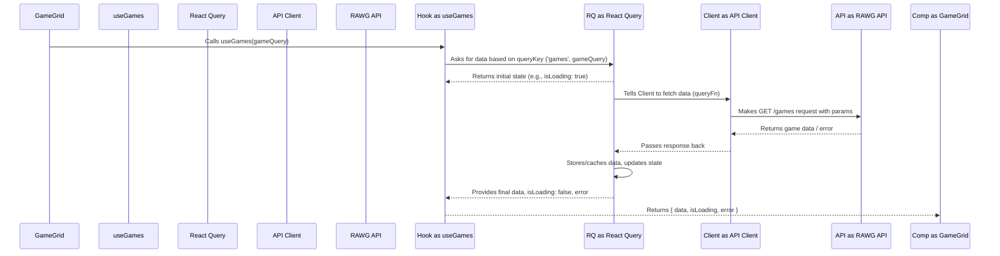

# Chapter 5: Data Fetching Hooks

Welcome back! In [Chapter 4: Game Display Components](04_game_display_components_.md), we saw how components like `GameGrid` and `GameCard` work together to display game information visually. We learned that `GameGrid` is responsible for showing the right games based on the user's choices stored in the `gameQuery` object ([Chapter 1: App Component & GameQuery State](01_app_component___gamequery_state_.md)).

But how does `GameGrid` actually *get* that list of games from the internet? How does `GenreList` get the list of genres, or `PlatformSelector` get the list of platforms?

Fetching data from an external source (like the RAWG API we use) involves several steps:
1.  Making the actual request (like asking a server for data).
2.  Showing a loading indicator while waiting for the response.
3.  Handling potential errors (what if the server is down or the request fails?).
4.  Storing the received data so the component can use it.
5.  Maybe even remembering (caching) the data so we don't have to ask for it again immediately.

Putting all this logic directly inside our display components (`GameGrid`, `GenreList`, etc.) would make them very long, complicated, and repetitive. Imagine writing the same loading/error logic in every component that needs data!

## The Solution: Our Specialized Librarians (Custom Hooks)

To keep our components clean and focused on *displaying* things, we use a powerful React feature called **Custom Hooks**.

Think of a custom hook like a specialized librarian at a massive library (the RAWG API). Instead of you needing to know exactly which aisle, shelf, and book number to find, you just go to the librarian and make a request.

In our project, we have three specialized librarians (custom hooks) for fetching data:

*   **`useGames`**: The librarian for finding games. You give it your request slip (the `gameQuery` object), and it handles finding the matching games.
*   **`useGenres`**: The librarian for genres. You ask it for the list of genres, and it fetches them.
*   **`usePlatforms`**: The librarian for platforms. You ask it for the list of platforms, and it fetches them.

These hooks encapsulate (hide away) all the complicated logic of making the API request, managing loading states, handling errors, and even caching the data (remembering the books) using a fantastic library called [React Query](06_react_query_integration_.md).

## Using Our Game Librarian: `useGames` in `GameGrid`

Let's revisit our `GameGrid` component from [Chapter 4: Game Display Components](04_game_display_components_.md) and see how it uses the `useGames` hook.

```typescript
// src/components/GameGrid.tsx (Focus on the hook)
import useGames from "../hooks/useGames"; // Import the librarian
import { GameQuery } from "../App"; // Import the request slip format

interface Props { gameQuery: GameQuery } // Expects the request slip

const GameGrid = ({ gameQuery }: Props) => {
  // Give the request slip (gameQuery) to the librarian (useGames)
  // Get back the results (data), loading status, and any errors
  const { data, error, isLoading } = useGames(gameQuery);

  // ... use isLoading to show skeletons ...
  // ... use error to show an error message ...
  // ... use data?.results to map over games and show GameCards ...
};
```

**Explanation:**

1.  We import our `useGames` hook (our game librarian).
2.  Inside the `GameGrid` component, we call `useGames(gameQuery)`. We pass the user's current preferences (`gameQuery`) as the argument – this is our request slip!
3.  The hook immediately returns an object with three crucial pieces of information:
    *   `data`: This will eventually hold the list of games fetched from the API. Initially, it might be empty or `undefined`.
    *   `isLoading`: A boolean (`true` or `false`). It's `true` while the librarian is still searching for the games (fetching data). It becomes `false` once the search is complete (or failed).
    *   `error`: If something went wrong during fetching (e.g., network problem), this will contain error information. Otherwise, it's usually `null`.
4.  `GameGrid` can then use these three variables (`data`, `isLoading`, `error`) to decide what to display: loading skeletons, an error message, or the actual list of `GameCard` components.

It's that simple from the component's perspective! All the complexity of fetching is handled inside `useGames`.

## What Happens Inside the Hook? (The Librarian's Process)

So, what magic does our `useGames` librarian perform when `GameGrid` calls it?

1.  **Receives Request:** The `useGames` hook receives the `gameQuery` object.
2.  **Consults React Query:** It uses a powerful helper library called React Query ([Chapter 6: React Query Integration](06_react_query_integration_.md)). Think of React Query as the library's main index or catalog system. `useGames` tells React Query, "I need games matching this `gameQuery`. Have you fetched this exact request recently?"
3.  **Check Cache (Optional):** React Query might already have the results for this exact `gameQuery` stored (cached) from a previous request. If so, it might return the cached data immediately while checking in the background if newer data is available (our librarian remembers the books!).
4.  **Prepare API Call:** If the data isn't cached or needs updating, React Query instructs our [API Client](07_api_client_.md) (our dedicated messenger to the external RAWG API) to make the actual network request. The `gameQuery` details (genre ID, platform ID, sort order, search text) are translated into parameters for the API call.
5.  **Make API Call:** The API Client sends the request over the internet to the RAWG API server. `isLoading` is typically `true` at this point.
6.  **Receive Response:** The RAWG API sends back the data (or an error).
7.  **Process Response:** The API Client receives the response. React Query takes this response, stores (caches) it for future use against the specific `gameQuery`, and updates the state.
8.  **Return Values:** The `useGames` hook gets the latest `data`, `isLoading` status (now likely `false`), and `error` status from React Query and returns them to the `GameGrid` component.

Here's a simplified diagram of that flow:



## A Glimpse Inside `useGames.ts`

Let's peek inside the actual hook file. It uses the `useQuery` hook provided by the React Query library.

```typescript
// src/hooks/useGames.ts (Simplified)
import { useQuery } from "@tanstack/react-query"; // React Query's hook
import apiClient, { FetchResponse } from "../services/api-client"; // Our messenger
import { Game } from './useGames'; // Game data blueprint
import { GameQuery } from "../App"; // Request slip format

const useGames = (gameQuery: GameQuery) =>
  useQuery<FetchResponse<Game>, Error>({
    // 1. The unique label for this request (librarian's filing code)
    queryKey: ['games', gameQuery],
    // 2. The function to run to get the data (librarian's instructions)
    queryFn: () =>
      apiClient.get('/games', { params: { /* ... use gameQuery ... */ } })
        .then(res => res.data)
  });

export default useGames;
```

**Explanation:**

1.  **`queryKey: ['games', gameQuery]`**: This is crucial for React Query. It's a unique identifier for this specific data request. Think of it like the label the librarian puts on the request slip and the resulting folder of books. If `gameQuery` changes (e.g., user selects a different genre), the `queryKey` changes, and React Query knows it's a *new* request. If the `queryKey` is the same as a recent request, React Query might use cached data.
2.  **`queryFn: () => apiClient.get(...)`**: This is the function that React Query will execute *only when it needs to actually fetch* the data (e.g., no fresh data in cache). This function uses our `apiClient` ([Chapter 7: API Client](07_api_client_.md)) to make the `GET` request to the `/games` endpoint of the RAWG API, passing the filters from `gameQuery` as parameters. `.then(res => res.data)` just extracts the actual data part from the server's response.

The `useQuery` hook from React Query handles all the background work: calling `queryFn` when needed, tracking the `isLoading` state, storing the `error`, caching the `data`, and automatically updating our component when things change.

## The Other Librarians: `useGenres` and `usePlatforms`

The hooks for fetching genres (`useGenres`) and platforms (`usePlatforms`) work very similarly, but are often simpler because they don't usually depend on changing filters like `gameQuery`. They mainly fetch a list once and then rely heavily on React Query's caching.

```typescript
// src/hooks/useGenres.ts (Simplified)
import { useQuery } from "@tanstack/react-query";
import apiClient, { FetchResponse } from "../services/api-client";
import { Genre } from './useGenres';

const useGenres = () => useQuery<FetchResponse<Genre>, Error>({
  queryKey: ['genres'], // Simple key: just asking for 'genres'
  queryFn: () => apiClient.get('/genres').then(res => res.data),
  // Tell React Query this data is good for a long time (24h)
  staleTime: 24 * 60 * 60 * 1000,
});

export default useGenres;
```

```typescript
// src/hooks/usePlatforms.ts (Simplified)
import { useQuery } from "@tanstack/react-query";
import apiClient, { FetchResponse } from "../services/api-client";
import { Platform } from './usePlatforms';

const usePlatforms = () => useQuery<FetchResponse<Platform>, Error>({
  queryKey: ['platforms'], // Simple key: just asking for 'platforms'
  queryFn: () => apiClient.get('/platforms/lists/parents').then(res => res.data),
  // Tell React Query this data is also good for a long time
  staleTime: 24 * 60 * 60 * 1000,
});

export default usePlatforms;
```

These hooks are used by `GenreList` and `PlatformSelector` respectively, providing them with the `data`, `isLoading`, and `error` state needed to display the lists of genres or platforms. The `staleTime` option tells React Query that once this data is fetched, it can be considered "fresh" for 24 hours, reducing unnecessary API calls for data that doesn't change often.

## Why Use These Hooks? The Benefits

*   **Clean Components:** Components like `GameGrid` stay focused on displaying UI, delegating data fetching to the hooks.
*   **Reusability:** If another component ever needed to fetch games, it could also use the `useGames` hook.
*   **Encapsulation:** All the logic for fetching a specific type of data (games, genres, platforms) is contained within its respective hook.
*   **Simplified State Management:** React Query (via the hooks) handles loading and error states automatically.
*   **Caching:** React Query provides powerful caching out-of-the-box, improving performance and reducing API usage.

## Summary

*   Fetching data from APIs involves handling requests, loading states, errors, and caching.
*   **Custom React Hooks** (`useGames`, `useGenres`, `usePlatforms`) act like specialized librarians, encapsulating data fetching logic.
*   Components call these hooks (e.g., `useGames(gameQuery)`) and receive `data`, `isLoading`, and `error` states.
*   Inside, the hooks use the **React Query** library (`useQuery`) to manage the fetching process, interact with our **API Client**, and handle caching.
*   This keeps our components clean and simplifies data management significantly.

## Next Steps

We've seen how our custom hooks simplify data fetching by leveraging a powerful library called React Query. But what exactly *is* React Query, and why is it so helpful? In the next chapter, we'll take a closer look at how we integrate and use React Query throughout our application.

Ready to uncover the magic behind the hooks? Let's dive into [Chapter 6: React Query Integration](06_react_query_integration_.md)!

---

Generated by [AI Codebase Knowledge Builder](https://github.com/The-Pocket/Tutorial-Codebase-Knowledge)