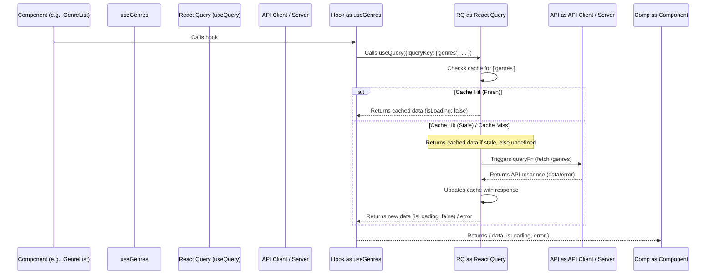

# Chapter 6: React Query Integration

Hello again! In [Chapter 5: Data Fetching Hooks](05_data_fetching_hooks_.md), we discovered how custom hooks like `useGames`, `useGenres`, and `usePlatforms` act like specialized librarians, fetching the data our components need without cluttering the components themselves. We saw that these hooks returned handy information like `data`, `isLoading`, and `error`.

But we hinted that there was some "magic" happening inside those hooks, powered by a library called React Query. What exactly *is* this magic, and why do we need it? Let's dive in!

## The Challenge: Managing Data from the Internet

Imagine our `GameGrid` component. Every time the user changes a filter (like selecting a genre or platform from the components in [Chapter 3: Filtering & Sorting Components](03_filtering___sorting_components_.md)), the `gameQuery` updates, and `GameGrid` needs to ask the internet (our RAWG API) for the new list of games.

Fetching data seems simple at first, but lots of questions pop up:

*   What if the user clicks "Action" then quickly clicks "RPG"? Do we need to finish loading *all* the Action games first?
*   What if the user selects "PC", looks at the games, goes to another page, and then comes back to the "PC" games list? Should we make them wait again while we fetch the *exact same list*?
*   What if multiple components on the screen happen to need the *same* data at the same time? Should they all ask the server independently?
*   How do we show loading spinners correctly? How do we handle network errors gracefully?
*   How do we make sure the data isn't too old (stale) without constantly asking the server?

Managing all this ("server state") can get complicated very quickly!

## Our Secret Weapon: React Query (`@tanstack/react-query`)

This is where React Query comes to the rescue! Think of React Query as an **incredibly smart assistant** specifically hired to manage all the data we get from the internet (the API).

It sits between our components/hooks and the actual process of asking the API for data. Its main jobs are:

1.  **Fetching:** Running the code to actually get the data (like our librarians' instructions).
2.  **Caching:** Remembering the data it has already fetched. If you ask for the same data again soon, it can often give it back to you instantly from its memory!
3.  **Updating:** Smartly figuring out when the remembered data might be old ("stale") and automatically fetching fresh data in the background, often without you even noticing a loading spinner.
4.  **Managing States:** Keeping track of whether data is currently loading (`isLoading`) or if an error occurred (`error`).

## Why is this Assistant So Helpful? (Key Benefits)

Using React Query makes our lives (and the user's experience) much better:

*   **Faster Feeling App (Caching):** Because React Query remembers data (caches it), if you request something it already has (like the list of genres you just saw), it can show it immediately. No need to wait for the internet again! It's like asking your assistant for notes from the *last* meeting – they have them ready instantly.
*   **Less Waiting (Background Updates):** React Query often shows you the cached (slightly old) data first, while it quietly checks in the background if there's anything newer. If there is, it seamlessly updates the screen. The user often doesn't even see a loading indicator for these background updates.
*   **Smarter Fetching (Deduplication):** If several parts of your app ask for the exact same data at almost the same time, React Query is smart enough to only make *one* request to the server. Efficient!
*   **Simpler Code:** It handles the tricky parts of loading states, error handling, and deciding when to refetch. This allowed our custom hooks in [Chapter 5: Data Fetching Hooks](05_data_fetching_hooks_.md) to be much simpler – they mostly just told React Query *what* to fetch and *how*, and React Query handled the rest.

## Setting Up Our Assistant: `main.tsx`

Before our smart assistant (React Query) can start working, we need to give it a place to manage everything. We do this right at the very top of our application, in the `main.tsx` file.

1.  **Create the Brain:** We create a `QueryClient`. This is like the central brain or filing cabinet for React Query, where it will store all the cached data and manage ongoing requests.
2.  **Provide the Brain:** We wrap our entire `App` component with a special component called `QueryClientProvider` and give it the `queryClient` we just created. This makes the "brain" and all of React Query's features available to *all* components within our application.

Here's how it looks in the code:

```typescript
// src/main.tsx (Simplified)
import React from "react";
import ReactDOM from "react-dom/client";
import { ChakraProvider } from "@chakra-ui/react";
// 1. Import React Query tools
import { QueryClient, QueryClientProvider } from "@tanstack/react-query";
import App from "./App";
import theme from "./theme";

// 2. Create the central "brain" for React Query
const queryClient = new QueryClient();

ReactDOM.createRoot(document.getElementById("root")!).render(
  <React.StrictMode>
    <ChakraProvider theme={theme}>
      {/* 3. Make the brain available to the whole App */}
      <QueryClientProvider client={queryClient}>
        <App />
        {/* We also added Devtools here for debugging (optional) */}
      </QueryClientProvider>
    </ChakraProvider>
  </React.StrictMode>
);
```

With this setup, React Query is ready to manage data fetching throughout our Game Hub.

## How Our Hooks Use React Query: The `useQuery` Hook

Now, let's revisit how our custom hooks from [Chapter 5: Data Fetching Hooks](05_data_fetching_hooks_.md) actually *use* React Query. They rely on a fundamental hook provided by React Query itself, called `useQuery`.

Remember `useGenres`? Here's a simplified look again:

```typescript
// src/hooks/useGenres.ts (Simplified)
import { useQuery } from "@tanstack/react-query"; // React Query's hook!
import apiClient from "../services/api-client"; // Our messenger
// ... other imports

const useGenres = () =>
  // This is where the magic happens!
  useQuery({ // Ask React Query to manage this data
    // 1. The Unique Label (Filing Code)
    queryKey: ["genres"],
    // 2. The Fetching Instructions (How to get it)
    queryFn: () => apiClient.get("/genres").then(res => res.data),
    // 3. Cache Settings (Optional: Keep it fresh for 24h)
    staleTime: 24 * 60 * 60 * 1000,
  });

export default useGenres;
```

**Explanation:**

1.  **`useQuery({...})`:** We call the `useQuery` hook given to us by the `@tanstack/react-query` library.
2.  **`queryKey: ["genres"]`:** This is **critical**. It's the unique name or "address" React Query uses to store and retrieve this specific piece of data (the list of genres) in its cache. If we used `useQuery` again somewhere else with the *exact same* `queryKey` (`["genres"]`), React Query would know we're talking about the same data. For `useGames`, the key included the `gameQuery` object (`queryKey: ['games', gameQuery]`), so every time the filters changed, the key changed, telling React Query it was a *different* request.
3.  **`queryFn: () => apiClient.get(...)`:** This function tells React Query *how* to fetch the data *if* it doesn't have fresh data in its cache for the given `queryKey`. React Query only runs this function when necessary. It uses our `apiClient` ([Chapter 7: API Client](07_api_client_.md)) to actually make the network request.
4.  **`staleTime: ...` (Optional):** This tells React Query: "Once you fetch this data, consider it 'fresh' and don't bother refetching it for 24 hours (unless forced)." This is great for data like genres that doesn't change often.

The `useQuery` hook then automatically returns the latest `data` it has (from cache or fetched), the `isLoading` status, and any `error` that occurred. This is exactly what our custom hooks passed back to our components!

## What Happens When `useQuery` Runs? (A Peek Inside)

Let's trace the steps when a component uses `useGenres`, which in turn calls `useQuery`:

1.  **Request:** `useGenres` calls `useQuery` with `queryKey: ["genres"]`.
2.  **Cache Check:** React Query looks in its cache (the `QueryClient` brain). Does it have data stored under the key `["genres"]`? Is that data still considered "fresh" (not older than `staleTime`)?
3.  **Cache Hit (Fresh):** If yes, React Query instantly returns the cached `data` and sets `isLoading` to `false`. Super fast!
4.  **Cache Hit (Stale):** If data exists but is "stale" (older than `staleTime`), React Query *still* returns the cached `data` immediately (so the UI updates quickly!). *But*, it also triggers the `queryFn` to run *in the background* to fetch fresh data. When the fresh data arrives, React Query updates the cache and seamlessly updates the component again.
5.  **Cache Miss:** If there's no data for `["genres"]` in the cache, React Query sets `isLoading` to `true` and runs the `queryFn`.
6.  **Fetch:** The `queryFn` runs, calling our `apiClient` to fetch `/genres` from the API.
7.  **Store & Return:** When the API responds, React Query gets the data, stores it in the cache under the `["genres"]` key, sets `isLoading` to `false`, and returns the new `data` to the `useGenres` hook (and thus to the component). If an error occurred during fetch, it stores the `error` instead.

Here's a simplified diagram:



React Query handles all this logic, making data fetching robust and efficient with minimal effort in our hooks and components.

## Summary

*   Managing data fetched from servers ("server state") involves caching, background updates, loading/error states, and more.
*   **React Query (`@tanstack/react-query`)** is a powerful library that acts like a smart assistant for server state.
*   It provides **caching**, **background synchronization**, **request deduplication**, and simplifies loading/error handling.
*   We set it up globally in `main.tsx` using `QueryClient` and `QueryClientProvider`.
*   Our custom data fetching hooks ([Chapter 5: Data Fetching Hooks](05_data_fetching_hooks_.md)) use React Query's **`useQuery`** hook internally.
*   `useQuery` requires a unique `queryKey` (the data's address) and a `queryFn` (how to fetch it).
*   React Query automatically manages the fetching process, caching, and provides `data`, `isLoading`, and `error` states to our application.

## Next Steps

We've seen how React Query manages the "when" and "why" of data fetching, and how the `queryFn` inside `useQuery` tells it *how* to fetch. That `queryFn` often uses a helper called `apiClient` to actually perform the communication with the RAWG API server.

In the next chapter, we'll look closely at this `apiClient` and how it helps us make standardized requests to our backend. Let's explore the [Chapter 7: API Client](07_api_client_.md)!
