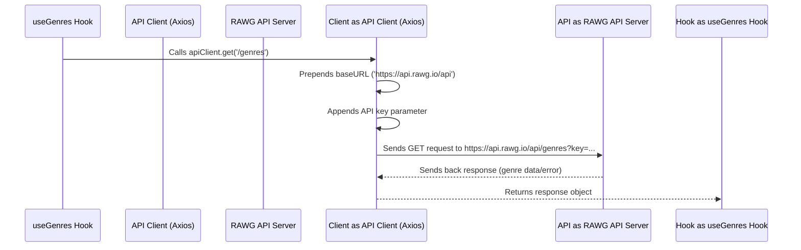

# Chapter 7: API Client

Welcome to the final chapter of our Game Hub tutorial! In [Chapter 6: React Query Integration](06_react_query_integration_.md), we saw how React Query acts as a smart assistant, managing *when* and *why* we fetch data using a `queryFn`. We learned that this `queryFn` contains the instructions on *how* to actually get the data from the external RAWG API.

But how exactly do we tell our application to talk to the RAWG API server? Every time we want to ask for data (like games, genres, or platforms), we need to:

1.  Know the correct web address (URL) for the RAWG API.
2.  Include our secret API key to prove we have permission to access the data.

Writing this connection code over and over again in every data fetching hook ([Chapter 5: Data Fetching Hooks](05_data_fetching_hooks_.md)) would be tedious and prone to errors. What if the API address changes? Or we need to update our API key? We'd have to find and change it in many different places!

## Our Dedicated Messenger: The API Client

To solve this, we created a dedicated helper: the **API Client**. It's defined in the file `src/services/api-client.ts`.

Think of the API Client like a **pre-addressed, pre-stamped envelope and a dedicated messenger service** just for talking to the RAWG API data warehouse.

*   **Pre-addressed:** It already knows the main address (`baseURL`) of the RAWG API.
*   **Pre-stamped (with a security pass):** It automatically includes your unique API key (`key`) with every message it sends.

Any component or hook in our app that needs data from RAWG doesn't need to worry about the full address or the API key. It just gives its specific request (like "get me the genres" or "find games matching these filters") to our `apiClient` messenger service. The `apiClient` handles constructing the full request correctly, sending it, and bringing back the response.

## What's Inside the `api-client.ts` File?

The `api-client.ts` file uses a popular library called **Axios** to handle the actual work of sending requests over the internet (HTTP requests). Axios is like the engine of our messenger service.

The core idea is to create a **pre-configured instance** of Axios. This means we set up Axios once with the common settings needed for *all* our RAWG API calls.

Here are the key pieces of configuration:

1.  **`baseURL`**: This tells our `apiClient` the main starting point for all RAWG API requests. All specific requests (like `/games` or `/genres`) will be added *after* this base URL.
    *   **Analogy:** This is like knowing the main street address of the huge RAWG data warehouse. `apiClient` knows it's `https://api.rawg.io/api`.

2.  **`params: { key: '...' }`**: This tells our `apiClient` to automatically add a specific parameter (`key`) with your unique API key value to *every single request* it sends.
    *   **Analogy:** This is like the messenger automatically showing a required security badge (`key`) every time they arrive at the warehouse gate.

## How Our Hooks Use the `apiClient`

Remember the `queryFn` inside our data fetching hooks from [Chapter 5: Data Fetching Hooks](05_data_fetching_hooks_.md)? They use our `apiClient` to do the actual fetching.

Let's look at a simplified `queryFn` from `useGenres`:

```typescript
// Simplified queryFn from src/hooks/useGenres.ts
import apiClient from "../services/api-client"; // 1. Import our messenger

// ... inside useQuery ...
  queryFn: () =>
    // 2. Use apiClient to make a GET request
    apiClient.get('/genres') // 3. Just specify the specific path!
      .then(res => res.data), // 4. Get the actual data from response
// ...
```

**Explanation:**

1.  We **import** our pre-configured `apiClient`.
2.  We call the `.get()` method on `apiClient`. This tells the messenger "I want to GET information".
3.  We only need to provide the **specific part** of the address we need: `/genres`. We don't need to write the full `https://api.rawg.io/api` or add the `?key=...` part. Our `apiClient` handles that automatically because it was pre-configured!
4.  `.then(res => res.data)` is used to extract the actual list of genres from the full response object that the server sends back.

Similarly, the `useGames` hook uses `apiClient.get('/games', { params: { ... } })`, passing the specific filters (genre, platform, sort order) as additional parameters *for that specific request*, while `apiClient` still handles the `baseURL` and the main `key` parameter automatically.

## Under the Hood: What Happens When You Call `apiClient.get()`?

Let's trace the simple journey when `useGenres` calls `apiClient.get('/genres')`:

1.  **Hook Calls Client:** The `useGenres` hook calls `apiClient.get('/genres')`.
2.  **Client Prepares URL:** The `apiClient` (our Axios instance) takes the provided path `/genres` and combines it with its configured `baseURL` ("https://api.rawg.io/api") to create the full URL: `https://api.rawg.io/api/genres`.
3.  **Client Adds Key:** The `apiClient` automatically adds the configured API `key` to the request parameters. The final request URL will look something like `https://api.rawg.io/api/genres?key=YOUR_API_KEY_HERE`.
4.  **Client Sends Request:** The underlying Axios library sends this complete HTTP GET request over the internet to the RAWG API server.
5.  **Server Responds:** The RAWG server processes the request and sends back a response containing the list of genres (or an error if something went wrong).
6.  **Client Returns Response:** The `apiClient` receives this response and passes it back to the `useGenres` hook (specifically, to the `.then()` part).

Here's a diagram visualizing this:



## A Look at the Code: `api-client.ts`

The actual code in `src/services/api-client.ts` is quite concise, thanks to Axios:

```typescript
// src/services/api-client.ts (Simplified)
import axios from "axios"; // Import the HTTP client library

// Defines the expected structure of API list responses
export interface FetchResponse<T> {
  count: number;
  results: T[];
}

// Create and export the pre-configured instance of Axios
export default axios.create({
  // Set the base address for all requests
  baseURL: "https://api.rawg.io/api",

  // Set parameters that will be included in *every* request
  params: {
    key: "YOUR_API_KEY_HERE", // Replace with your actual key!
    // (Get your free key from rawg.io/apikey)
  },
});
```

**Explanation:**

*   We import the `axios` library.
*   We define a helper `FetchResponse` interface. This helps ensure ([Chapter 2: Data Types (TypeScript Interfaces)](02_data_types__typescript_interfaces__.md)) that we correctly handle responses from the RAWG API that typically contain a `count` and a `results` array.
*   `axios.create({ ... })` creates our special, configured instance.
*   `baseURL` sets the main address.
*   `params: { key: '...' }` sets the default parameters (our API key) to be sent with every request made through this specific `apiClient` instance.
*   **Remember:** You need to replace `"YOUR_API_KEY_HERE"` with the actual API key you obtained from the RAWG website.

That's it! Now, anywhere in our app, we can import this `apiClient` and make requests to RAWG without rewriting the base URL or API key every time.

## Why Was This Helpful?

Using an API Client provides several advantages:

*   **DRY (Don't Repeat Yourself):** We define the base URL and API key only once, avoiding repetition in multiple hooks.
*   **Easy Maintenance:** If the API base URL ever changes, or you need to update your API key, you only need to change it in *one* file (`api-client.ts`).
*   **Cleaner Code:** Our data fetching hooks ([Chapter 5: Data Fetching Hooks](05_data_fetching_hooks_.md)) become simpler and more focused on the *specific* data they need, as they delegate the common connection details to the `apiClient`.

## Conclusion: The End of the Line!

And that's the role of our `apiClient` – it acts as a clean, configured gateway for all communication between our Game Hub application and the external RAWG API. It simplifies our data fetching logic by handling the common setup (base address, API key) automatically.

Congratulations! You've made it through all the core concepts of the Game Hub project:

*   How the main `App` component manages state ([Chapter 1: App Component & GameQuery State](01_app_component___gamequery_state_.md)).
*   How we define data structures with TypeScript ([Chapter 2: Data Types (TypeScript Interfaces)](02_data_types__typescript_interfaces__.md)).
*   How users filter and sort using specific components ([Chapter 3: Filtering & Sorting Components](03_filtering___sorting_components_.md)).
*   How games are displayed visually ([Chapter 4: Game Display Components](04_game_display_components_.md)).
*   How we fetch data cleanly using custom hooks ([Chapter 5: Data Fetching Hooks](05_data_fetching_hooks_.md)).
*   How React Query makes data fetching robust and efficient ([Chapter 6: React Query Integration](06_react_query_integration_.md)).
*   And finally, how the API Client standardizes communication with the backend ([Chapter 7: API Client](#chapter-7-api-client)).

We hope this tutorial has given you a solid understanding of how the different pieces of the Game Hub project fit together. Feel free to explore the code further, experiment by adding new features (like different sorting options, more details on the game cards, or even user accounts!), and continue your learning journey in React and web development.

Happy coding!

---

Generated by [AI Codebase Knowledge Builder](https://github.com/The-Pocket/Tutorial-Codebase-Knowledge)