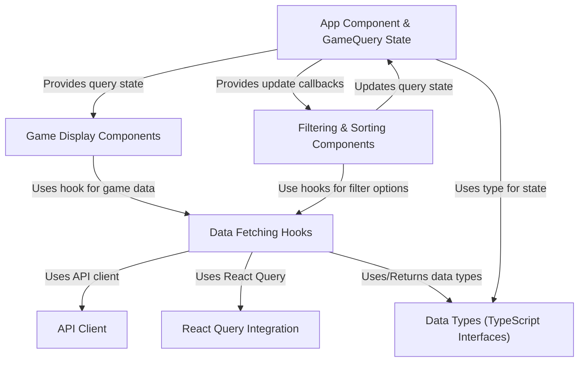

# Tutorial: game-hub

Game Hub is a web application that allows users to discover video games.
It **fetches data** from the *RAWG API* and presents it in a responsive grid.
Users can **filter** games by *genre* and *platform*, apply different **sorting** options, and **search** for specific titles to refine the displayed results.

**Source Repository:** [https://github.com/Paulgorithms/game-hub](https://github.com/Paulgorithms/game-hub)

## Chapters

1. [App Component & GameQuery State
](01_app_component___gamequery_state_.md)
2. [Data Types (TypeScript Interfaces)
](02_data_types__typescript_interfaces__.md)
3. [Filtering & Sorting Components
](03_filtering___sorting_components_.md)
4. [Game Display Components
](04_game_display_components_.md)
5. [Data Fetching Hooks
](05_data_fetching_hooks_.md)
6. [React Query Integration
](06_react_query_integration_.md)
7. [API Client
](07_api_client_.md)
